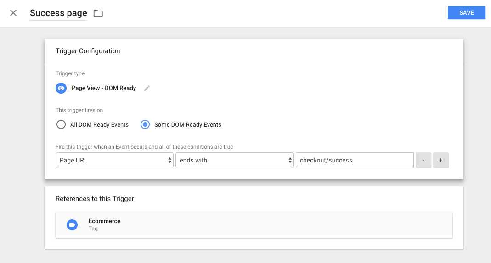
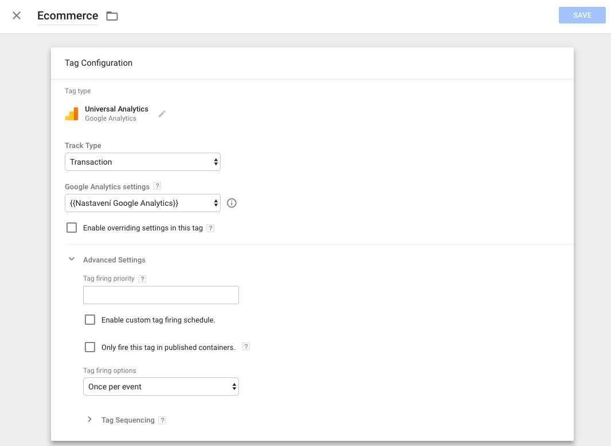

# Google Tag Manager E-commerce tracking for [OpenCart 2.x](https://github.com/opencart/opencart)

note: developed on version 2.3.2, other versions can need some edits - **fell free to contribute!**

## Installation

1. Requiring installed [vQmod](https://github.com/vqmod/vqmod) because vQmod doesn't support installing via composer itself.
2. `composer require burdapraha/oc_gtm_ecommerce`
3. `composer require sasedev/composer-plugin-filecopier` for files manipulating
4. Add this code to your composer.json project file, extra section:

```
    "extra": {
        "filescopier": [
            {
                "source": "vendor/burdapraha/oc_gtm_ecommerce/upload",
                "destination": "upload",
                "debug": "true"
            }
        ]
    }    
```
    
It will move vQmod xml file to correct folder.

5. setup your GTM (some tutorial [here](https://www.optimizesmart.com/implementing-e-commerce-tracking-google-tag-manager/))





6. optionally you can add row to your .gitignore file with path to gtm_ecommerce.xml (example: upload/vqmod/xml/gtm_ecommerce.xml)
7. celebrate!